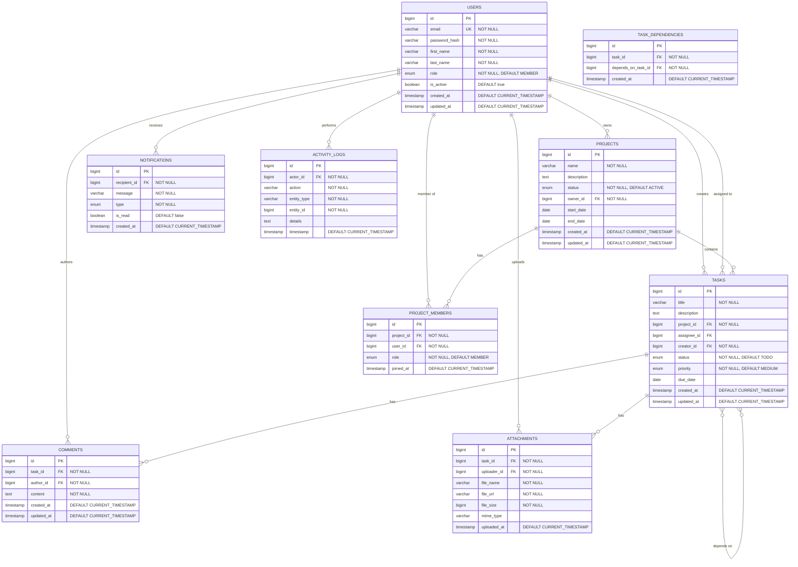

# ER Diagram

## Task Management System - Database Schema

## Table Descriptions

### USERS
Stores user account information with authentication credentials and role-based access control.

**Indexes:**
- PRIMARY KEY (id)
- UNIQUE INDEX (email)
- INDEX (role)

**Constraints:**
- email must be unique and valid format
- password_hash must be bcrypt/argon2 hashed
- role: ADMIN, MANAGER, MEMBER

### PROJECTS
Contains project information with ownership and status tracking.

**Indexes:**
- PRIMARY KEY (id)
- FOREIGN KEY (owner_id) REFERENCES USERS(id)
- INDEX (owner_id)
- INDEX (status)

**Constraints:**
- status: ACTIVE, COMPLETED, ARCHIVED, ON_HOLD
- end_date must be >= start_date

### PROJECT_MEMBERS
Junction table for many-to-many relationship between users and projects with role assignment.

**Indexes:**
- PRIMARY KEY (id)
- FOREIGN KEY (project_id) REFERENCES PROJECTS(id) ON DELETE CASCADE
- FOREIGN KEY (user_id) REFERENCES USERS(id) ON DELETE CASCADE
- UNIQUE INDEX (project_id, user_id)
- INDEX (user_id)

**Constraints:**
- role: OWNER, ADMIN, MEMBER, VIEWER
- Composite unique constraint on (project_id, user_id)

### TASKS
Core task management table with assignment, status, and priority tracking.

**Indexes:**
- PRIMARY KEY (id)
- FOREIGN KEY (project_id) REFERENCES PROJECTS(id) ON DELETE CASCADE
- FOREIGN KEY (assignee_id) REFERENCES USERS(id) ON DELETE SET NULL
- FOREIGN KEY (creator_id) REFERENCES USERS(id) ON DELETE SET NULL
- INDEX (project_id)
- INDEX (assignee_id)
- INDEX (status)
- INDEX (due_date)

**Constraints:**
- status: TODO, IN_PROGRESS, REVIEW, DONE
- priority: LOW, MEDIUM, HIGH, CRITICAL

### TASK_DEPENDENCIES
Manages task dependencies for workflow ordering.

**Indexes:**
- PRIMARY KEY (id)
- FOREIGN KEY (task_id) REFERENCES TASKS(id) ON DELETE CASCADE
- FOREIGN KEY (depends_on_task_id) REFERENCES TASKS(id) ON DELETE CASCADE
- UNIQUE INDEX (task_id, depends_on_task_id)

**Constraints:**
- Prevent circular dependencies (application level)
- task_id != depends_on_task_id

### COMMENTS
Stores task comments for collaboration.

**Indexes:**
- PRIMARY KEY (id)
- FOREIGN KEY (task_id) REFERENCES TASKS(id) ON DELETE CASCADE
- FOREIGN KEY (author_id) REFERENCES USERS(id) ON DELETE SET NULL
- INDEX (task_id)
- INDEX (created_at)

### ATTACHMENTS
Manages file attachments linked to tasks.

**Indexes:**
- PRIMARY KEY (id)
- FOREIGN KEY (task_id) REFERENCES TASKS(id) ON DELETE CASCADE
- FOREIGN KEY (uploader_id) REFERENCES USERS(id) ON DELETE SET NULL
- INDEX (task_id)

**Constraints:**
- file_size limit (e.g., 10MB)
- Allowed mime_types validation

### NOTIFICATIONS
Real-time notification system for user alerts.

**Indexes:**
- PRIMARY KEY (id)
- FOREIGN KEY (recipient_id) REFERENCES USERS(id) ON DELETE CASCADE
- INDEX (recipient_id, is_read)
- INDEX (created_at)

**Constraints:**
- type: TASK_ASSIGNED, TASK_UPDATED, COMMENT_ADDED, DEADLINE_APPROACHING, PROJECT_UPDATED

### ACTIVITY_LOGS
Audit trail for all system actions.

**Indexes:**
- PRIMARY KEY (id)
- FOREIGN KEY (actor_id) REFERENCES USERS(id) ON DELETE SET NULL
- INDEX (entity_type, entity_id)
- INDEX (actor_id)
- INDEX (timestamp)

**Constraints:**
- Immutable records (no updates/deletes)
- Retention policy (e.g., 1 year)

## Database Relationships

### One-to-Many Relationships
1. USERS → PROJECTS (owner)
2. USERS → TASKS (creator)
3. USERS → TASKS (assignee)
4. USERS → COMMENTS (author)
5. USERS → ATTACHMENTS (uploader)
6. USERS → NOTIFICATIONS (recipient)
7. PROJECTS → TASKS (contains)
8. TASKS → COMMENTS (has)
9. TASKS → ATTACHMENTS (has)

### Many-to-Many Relationships
1. USERS ↔ PROJECTS (through PROJECT_MEMBERS)
2. TASKS ↔ TASKS (through TASK_DEPENDENCIES)

## Database Normalization

The schema follows Third Normal Form (3NF):
- All tables have primary keys
- No repeating groups
- All non-key attributes depend on the primary key
- No transitive dependencies

## Performance Considerations

1. **Indexes**: Strategic indexes on foreign keys and frequently queried columns
2. **Cascading Deletes**: Proper CASCADE rules for data integrity
3. **Soft Deletes**: Consider adding deleted_at for USERS and PROJECTS
4. **Partitioning**: ACTIVITY_LOGS can be partitioned by timestamp
5. **Archiving**: Old completed projects can be archived to separate tables
