# Class Diagram

## Task Management System - Major Classes and Relationships

```mermaid
classDiagram
    %% Entity Classes
    class User {
        -Long id
        -String email
        -String password
        -String firstName
        -String lastName
        -Role role
        -Boolean isActive
        -Date createdAt
        -Date updatedAt
        +login() boolean
        +updateProfile() void
        +changePassword() boolean
        +hasPermission(String permission) boolean
    }

    class Role {
        <<enumeration>>
        ADMIN
        MANAGER
        MEMBER
    }

    class Project {
        -Long id
        -String name
        -String description
        -ProjectStatus status
        -User owner
        -Date startDate
        -Date endDate
        -Date createdAt
        -Date updatedAt
        +addMember(User user) void
        +removeMember(User user) void
        +updateStatus(ProjectStatus status) void
        +getProgress() double
    }

    class ProjectStatus {
        <<enumeration>>
        ACTIVE
        COMPLETED
        ARCHIVED
        ON_HOLD
    }

    class Task {
        -Long id
        -String title
        -String description
        -Project project
        -User assignee
        -User creator
        -TaskStatus status
        -Priority priority
        -Date dueDate
        -Date createdAt
        -Date updatedAt
        +assign(User user) void
        +updateStatus(TaskStatus status) boolean
        +isOverdue() boolean
        +canTransitionTo(TaskStatus newStatus) boolean
    }

    class TaskStatus {
        <<enumeration>>
        TODO
        IN_PROGRESS
        REVIEW
        DONE
    }

    class Priority {
        <<enumeration>>
        LOW
        MEDIUM
        HIGH
        CRITICAL
    }

    class Comment {
        -Long id
        -Task task
        -User author
        -String content
        -Date createdAt
        -Date updatedAt
        +edit(String newContent) void
        +delete() void
    }

    class Attachment {
        -Long id
        -Task task
        -User uploader
        -String fileName
        -String fileUrl
        -Long fileSize
        -Date uploadedAt
        +download() byte[]
        +delete() void
    }

    class Notification {
        -Long id
        -User recipient
        -String message
        -NotificationType type
        -Boolean isRead
        -Date createdAt
        +markAsRead() void
        +send() void
    }

    class NotificationType {
        <<enumeration>>
        TASK_ASSIGNED
        TASK_UPDATED
        COMMENT_ADDED
        DEADLINE_APPROACHING
        PROJECT_UPDATED
    }

    class ActivityLog {
        -Long id
        -User actor
        -String action
        -String entityType
        -Long entityId
        -String details
        -Date timestamp
        +getDescription() String
    }

    class ProjectMember {
        -Long id
        -Project project
        -User user
        -MemberRole role
        -Date joinedAt
        +hasPermission(String permission) boolean
    }

    class MemberRole {
        <<enumeration>>
        OWNER
        ADMIN
        MEMBER
        VIEWER
    }

    %% Controller Classes
    class AuthController {
        -AuthService authService
        +register(RegisterDTO dto) ResponseEntity
        +login(LoginDTO dto) ResponseEntity
        +logout() ResponseEntity
        +refreshToken() ResponseEntity
    }

    class UserController {
        -UserService userService
        +getProfile() ResponseEntity
        +updateProfile(UserDTO dto) ResponseEntity
        +changePassword(PasswordDTO dto) ResponseEntity
        +getAllUsers() ResponseEntity
    }

    class ProjectController {
        -ProjectService projectService
        +createProject(ProjectDTO dto) ResponseEntity
        +getProject(Long id) ResponseEntity
        +updateProject(Long id, ProjectDTO dto) ResponseEntity
        +deleteProject(Long id) ResponseEntity
        +addMember(Long projectId, Long userId) ResponseEntity
    }

    class TaskController {
        -TaskService taskService
        +createTask(TaskDTO dto) ResponseEntity
        +getTask(Long id) ResponseEntity
        +updateTask(Long id, TaskDTO dto) ResponseEntity
        +updateStatus(Long id, TaskStatus status) ResponseEntity
        +assignTask(Long id, Long userId) ResponseEntity
        +deleteTask(Long id) ResponseEntity
    }

    %% Service Classes
    class AuthService {
        -UserRepository userRepository
        -JwtUtil jwtUtil
        -PasswordEncoder passwordEncoder
        +register(RegisterDTO dto) User
        +authenticate(String email, String password) String
        +validateToken(String token) boolean
    }

    class UserService {
        -UserRepository userRepository
        -NotificationService notificationService
        +createUser(UserDTO dto) User
        +getUserById(Long id) User
        +updateUser(Long id, UserDTO dto) User
        +deleteUser(Long id) void
        +getAllUsers() List~User~
    }

    class ProjectService {
        -ProjectRepository projectRepository
        -UserService userService
        -NotificationService notificationService
        +createProject(ProjectDTO dto, User owner) Project
        +getProjectById(Long id) Project
        +updateProject(Long id, ProjectDTO dto) Project
        +addMember(Long projectId, Long userId) void
        +validateAccess(Long projectId, Long userId) boolean
    }

    class TaskService {
        -TaskRepository taskRepository
        -ProjectService projectService
        -NotificationService notificationService
        -ActivityLogService activityLogService
        +createTask(TaskDTO dto, User creator) Task
        +getTaskById(Long id) Task
        +updateTask(Long id, TaskDTO dto) Task
        +updateStatus(Long id, TaskStatus status, User user) Task
        +assignTask(Long id, User assignee) Task
        +validateStatusTransition(TaskStatus from, TaskStatus to) boolean
    }

    class NotificationService {
        -NotificationRepository notificationRepository
        -WebSocketService webSocketService
        +createNotification(User recipient, String message, NotificationType type) Notification
        +sendNotification(Notification notification) void
        +markAsRead(Long notificationId) void
        +getUserNotifications(Long userId) List~Notification~
    }

    class ActivityLogService {
        -ActivityLogRepository activityLogRepository
        +logActivity(User actor, String action, String entityType, Long entityId) void
        +getActivityLog(String entityType, Long entityId) List~ActivityLog~
    }

    class WebSocketService {
        -SimpMessagingTemplate messagingTemplate
        +sendToUser(Long userId, Object message) void
        +broadcastToProject(Long projectId, Object message) void
    }

    %% Repository Interfaces
    class UserRepository {
        <<interface>>
        +findById(Long id) Optional~User~
        +findByEmail(String email) Optional~User~
        +save(User user) User
        +delete(User user) void
        +findAll() List~User~
    }

    class ProjectRepository {
        <<interface>>
        +findById(Long id) Optional~Project~
        +findByOwnerId(Long ownerId) List~Project~
        +save(Project project) Project
        +delete(Project project) void
    }

    class TaskRepository {
        <<interface>>
        +findById(Long id) Optional~Task~
        +findByProjectId(Long projectId) List~Task~
        +findByAssigneeId(Long assigneeId) List~Task~
        +save(Task task) Task
        +delete(Task task) void
    }

    class NotificationRepository {
        <<interface>>
        +findById(Long id) Optional~Notification~
        +findByRecipientId(Long recipientId) List~Notification~
        +save(Notification notification) Notification
    }

    class ActivityLogRepository {
        <<interface>>
        +save(ActivityLog log) ActivityLog
        +findByEntityTypeAndEntityId(String type, Long id) List~ActivityLog~
    }

    %% Relationships - Entities
    User "1" --> "1" Role : has
    User "1" --> "*" Project : owns
    User "1" --> "*" Task : creates
    User "1" --> "*" Task : assigned to
    User "1" --> "*" Comment : authors
    User "1" --> "*" Notification : receives
    User "1" --> "*" ActivityLog : performs
    
    Project "1" --> "1" ProjectStatus : has
    Project "1" --> "*" Task : contains
    Project "1" --> "*" ProjectMember : has
    
    ProjectMember "*" --> "1" User : references
    ProjectMember "*" --> "1" Project : belongs to
    ProjectMember "1" --> "1" MemberRole : has
    
    Task "1" --> "1" TaskStatus : has
    Task "1" --> "1" Priority : has
    Task "*" --> "1" Project : belongs to
    Task "1" --> "*" Comment : has
    Task "1" --> "*" Attachment : has
    
    Comment "*" --> "1" Task : belongs to
    Attachment "*" --> "1" Task : belongs to
    
    Notification "1" --> "1" NotificationType : has
    
    %% Relationships - Controllers to Services
    AuthController --> AuthService : uses
    UserController --> UserService : uses
    ProjectController --> ProjectService : uses
    TaskController --> TaskService : uses
    
    %% Relationships - Services to Repositories
    AuthService --> UserRepository : uses
    UserService --> UserRepository : uses
    UserService --> NotificationService : uses
    ProjectService --> ProjectRepository : uses
    ProjectService --> UserService : uses
    ProjectService --> NotificationService : uses
    TaskService --> TaskRepository : uses
    TaskService --> ProjectService : uses
    TaskService --> NotificationService : uses
    TaskService --> ActivityLogService : uses
    NotificationService --> NotificationRepository : uses
    NotificationService --> WebSocketService : uses
    ActivityLogService --> ActivityLogRepository : uses
```

## Key Design Principles Applied

### 1. Encapsulation
- Private fields with public methods
- Data hiding in entity classes
- Controlled access through getters/setters

### 2. Abstraction
- Repository interfaces abstract data access
- Service layer abstracts business logic
- Controller layer abstracts HTTP handling

### 3. Inheritance
- Could extend: BaseEntity (id, createdAt, updatedAt)
- Role hierarchy for permissions
- Exception hierarchy for error handling

### 4. Polymorphism
- Repository interface implementations
- Strategy pattern for notification types
- Different task assignment strategies

### 5. Design Patterns
- **Repository Pattern**: Data access abstraction
- **Service Layer Pattern**: Business logic separation
- **Dependency Injection**: Loose coupling
- **Observer Pattern**: Notification system
- **Strategy Pattern**: Status transition validation
- **Factory Pattern**: Notification creation
