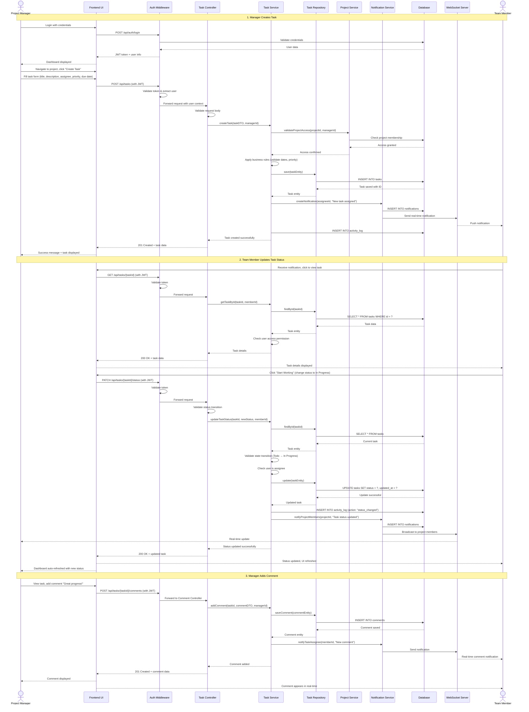

# Sequence Diagram

## Main Flow: Create Task and Update Status (End-to-End)

## Flow Description

### Phase 1: Authentication & Task Creation
1. Manager logs in and receives JWT token
2. Manager navigates to project and creates new task
3. System validates manager's permissions
4. Task is saved to database
5. Notification sent to assigned team member
6. Activity logged for audit trail

### Phase 2: Task Status Update
1. Team member receives notification
2. Member views task details
3. Member updates task status (Todo → In Progress)
4. System validates status transition rules
5. Database updated with new status
6. Real-time notification sent to project manager
7. Activity logged

### Phase 3: Collaboration
1. Manager views updated task
2. Manager adds comment
3. Comment saved and notification sent
4. Team member receives real-time update

## Key Design Patterns Demonstrated

- **Layered Architecture**: Clear separation (Controller → Service → Repository)
- **Middleware Pattern**: Authentication/Authorization middleware
- **Repository Pattern**: Data access abstraction
- **Service Layer Pattern**: Business logic encapsulation
- **Observer Pattern**: Real-time notifications via WebSocket
- **Strategy Pattern**: Status transition validation
