# Use Case Diagram

## Task Management System - Use Cases

```mermaid
graph TB
    subgraph "Task Management System"
        UC1[Register/Login]
        UC2[Manage Profile]
        UC3[Create Project]
        UC4[Manage Project]
        UC5[Create Task]
        UC6[Assign Task]
        UC7[Update Task Status]
        UC8[Add Comment]
        UC9[Upload Attachment]
        UC10[View Dashboard]
        UC11[Generate Reports]
        UC12[Manage Users]
        UC13[Set Permissions]
        UC14[Receive Notifications]
        UC15[View Activity Log]
    end
    
    Guest[Guest User]
    Member[Team Member]
    Manager[Project Manager]
    Admin[System Admin]
    
    Guest --> UC1
    
    Member --> UC1
    Member --> UC2
    Member --> UC7
    Member --> UC8
    Member --> UC9
    Member --> UC10
    Member --> UC14
    Member --> UC15
    
    Manager --> UC1
    Manager --> UC2
    Manager --> UC3
    Manager --> UC4
    Manager --> UC5
    Manager --> UC6
    Manager --> UC7
    Manager --> UC8
    Manager --> UC9
    Manager --> UC10
    Manager --> UC11
    Manager --> UC14
    Manager --> UC15
    
    Admin --> UC1
    Admin --> UC2
    Admin --> UC3
    Admin --> UC4
    Admin --> UC5
    Admin --> UC6
    Admin --> UC7
    Admin --> UC8
    Admin --> UC9
    Admin --> UC10
    Admin --> UC11
    Admin --> UC12
    Admin --> UC13
    Admin --> UC14
    Admin --> UC15
```

## Use Case Descriptions

### UC1: Register/Login
- **Actor**: Guest User, Team Member, Manager, Admin
- **Description**: User creates account or authenticates to access system
- **Preconditions**: None for registration; Valid credentials for login
- **Postconditions**: User session created, JWT token issued

### UC2: Manage Profile
- **Actor**: Team Member, Manager, Admin
- **Description**: User updates personal information, password, preferences
- **Preconditions**: User authenticated
- **Postconditions**: Profile information updated

### UC3: Create Project
- **Actor**: Manager, Admin
- **Description**: Create new project with details and team assignment
- **Preconditions**: User has Manager/Admin role
- **Postconditions**: New project created in database

### UC4: Manage Project
- **Actor**: Manager, Admin
- **Description**: Update project details, status, or archive project
- **Preconditions**: User has permission for the project
- **Postconditions**: Project information updated

### UC5: Create Task
- **Actor**: Manager, Admin
- **Description**: Create new task within a project
- **Preconditions**: Project exists, user has permission
- **Postconditions**: Task created and assigned

### UC6: Assign Task
- **Actor**: Manager, Admin
- **Description**: Assign or reassign task to team member
- **Preconditions**: Task exists, assignee is project member
- **Postconditions**: Task assignment updated, notification sent

### UC7: Update Task Status
- **Actor**: Team Member, Manager, Admin
- **Description**: Change task status through workflow
- **Preconditions**: User assigned to task or has permission
- **Postconditions**: Task status updated, activity logged

### UC8: Add Comment
- **Actor**: Team Member, Manager, Admin
- **Description**: Add comment to task for collaboration
- **Preconditions**: User has access to task
- **Postconditions**: Comment saved, notification sent

### UC9: Upload Attachment
- **Actor**: Team Member, Manager, Admin
- **Description**: Attach files to tasks
- **Preconditions**: User has access to task
- **Postconditions**: File stored, reference saved

### UC10: View Dashboard
- **Actor**: Team Member, Manager, Admin
- **Description**: View personalized dashboard with tasks and metrics
- **Preconditions**: User authenticated
- **Postconditions**: Dashboard data displayed

### UC11: Generate Reports
- **Actor**: Manager, Admin
- **Description**: Generate analytics and productivity reports
- **Preconditions**: User has Manager/Admin role
- **Postconditions**: Report generated and displayed

### UC12: Manage Users
- **Actor**: Admin
- **Description**: Create, update, deactivate user accounts
- **Preconditions**: User has Admin role
- **Postconditions**: User account modified

### UC13: Set Permissions
- **Actor**: Admin
- **Description**: Configure role-based permissions
- **Preconditions**: User has Admin role
- **Postconditions**: Permissions updated

### UC14: Receive Notifications
- **Actor**: Team Member, Manager, Admin
- **Description**: Receive real-time notifications for updates
- **Preconditions**: User authenticated, WebSocket connected
- **Postconditions**: Notification displayed

### UC15: View Activity Log
- **Actor**: Team Member, Manager, Admin
- **Description**: View audit trail of actions
- **Preconditions**: User has access to project/task
- **Postconditions**: Activity log displayed
